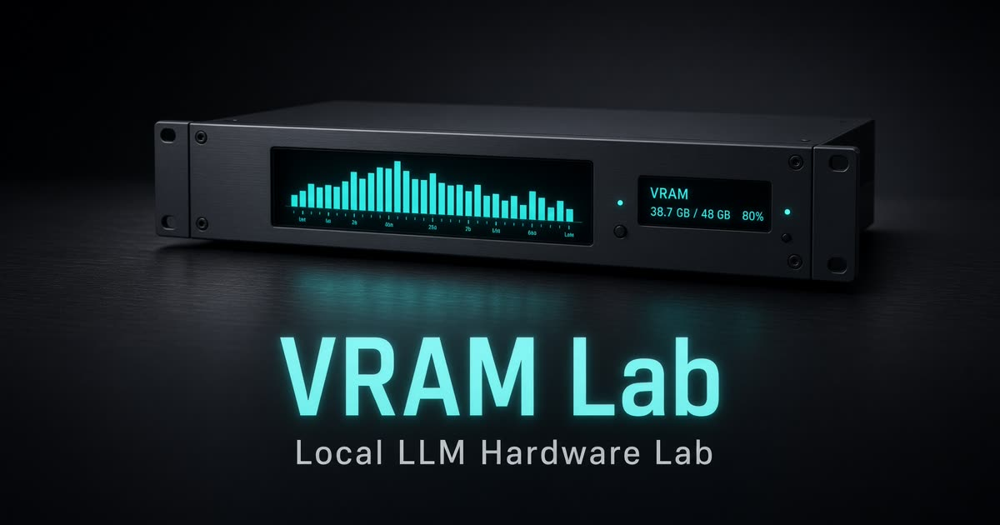

# VRAM Lab

本地 LLM 硬體與模型配置實驗室。選 GPU、模型、量化與 context，即時估算權重 VRAM、KV cache、完整需求、GPU 實際配置、容量缺口與生成速度。

**線上使用：** [https://kite-yarrow-glow-light.grok.me](https://kite-yarrow-glow-light.grok.me)



資料基準日：2026-09-12。速度與 VRAM 都是**理論估算**，不是實測 benchmark。

---

## 這是什麼

規劃家用／工作站跑本地 LLM 時，先看這組硬體能不能完整 GPU offload、要不要 CPU 承接、context 能開多大。設定會存在瀏覽器 `localStorage`，不需登入。

同一組設定會貫穿：

- 實驗室
- VRAM 推薦
- 對照台
- llama.cpp / Ollama / vLLM 啟動指令

## 功能

- **GPU 目錄**：6–8 GB 到 96 GB，含 30／40／50 系、3090×2、A6000、PRO 6000、7900 XTX
- **模型**：Qwen、Llama、Gemma、DeepSeek、Nemotron、Ministral、Phi 等，含 MoE（Scout、V3、Qwen3-A3B）
- **量化**：Q2、Q3_K_M、IQ4_XS、Q4_K_S、Q4_K_M、Q5、Q6、Q8、FP16
- **顯存拆開顯示**：完整需求、GPU 實際配置、CPU／RAM 承接、容量缺口
- **自訂 VRAM**：輸入 4 GB 再載入推薦，容量仍按 4 GB 算；最接近的卡只當速度參考
- **系統 RAM 與後端**：CPU offload 會看 RAM；vLLM 放不下就判定不適合
- **啟動指令**：層數、context、KV 精度、Flash Attention 會寫進指令；後端不支援的組合會標出來
- **VRAM 推薦**：最舒服／最大挑戰／也適合，挑戰檔會列出量化、速度、context、記憶體代價

判定：很適合／可以跑但有妥協／勉強／不適合。

## 估算公式（摘要）

| 項目 | 怎麼算 |
| --- | --- |
| 權重 VRAM | 參數量(B) × 每權重位元 / 8，對齊常見 GGUF 大小 |
| KV cache | `2 × 注意力層 × KV heads × head_dim × context × 每元素位元組 / 1024³` |
| 完整需求 | 權重 + KV + 開銷（CUDA／compute buffer／ggml） |
| 容量缺口 | `max(0, 完整需求 − 可用 VRAM)` |
| 系統 RAM | 約 6 GB 保留 + CPU 承接權重 × 1.15 |
| 速度 | 顯卡頻寬 × 解碼效率 / 有效權重，再加 kernel 開銷；MoE 用 active 參數估 decode |

架構數字來自各模型公開 config。會受後端、CPU、記憶體頻寬、prompt 長度、驅動與是否開 Flash Attention 影響。

## 技術棧

- TanStack Start + React
- Zustand（persist）
- Tailwind CSS v4
- 純前端，無帳號、無後端資料庫

## 本地開發

```bash
npm install
npm run dev
```

```bash
npm run typecheck
npx tsx --test src/lib/lab/calc.test.ts
```

主要程式在 `src/lib/lab/`（計算、目錄、推薦）與 `src/components/lab/`（實驗室 UI）。

## 授權

私人倉庫。估算僅供規劃參考，請以你本機實際 llama.cpp / Ollama / vLLM 為準。
